# SERVICE DESIGN (MERMAID)

Tai lieu nay mo ta thiet ke tong quan cho tung service backend cua Kiemtra01.

Ghi chu:
- So do la thiet ke muc he thong (high-level class design), khong phai UML implementation 1:1.
- Ten class/doi tuong duoc dat theo code hien tai de de doi chieu.

## 1) gateway-service

Chuc nang chinh:
- Auth customer/staff
- Route/proxy request den service nghiep vu
- Tong hop catalog search
- Route rieng cho PC endpoint

```mermaid
classDiagram
class RootView
class HealthView
class ServiceInfoView
class CustomerLoginView
class StaffLoginView
class CatalogSearchView
class CartCreateView
class CartAddView
class CartGetView
class CustomerCheckoutView
class StaffAddProductView
class StaffUpdateProductView
class StaffImportAssetView
class InventoryProxyView
class InventoryCheckProxyView
class OrderProxyView
class PaymentProxyView
class PaymentCreateProxyView
class PcProductView
class PcProductDetailView
class PcInventoryCheckView
class PcInventoryDeductView
class JwtAuthUtils {
  +build_token()
  +decode_token()
  +require_role()
}
CatalogSearchView --> JwtAuthUtils
StaffAddProductView --> JwtAuthUtils
StaffUpdateProductView --> JwtAuthUtils
PcProductDetailView --> JwtAuthUtils
```

## 2) customer-service

Chuc nang chinh:
- Customer login
- Catalog search (all|laptop|mobile|pc)
- Quan ly cart customer
- Checkout customer

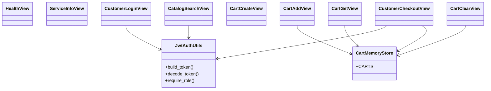

## 3) staff-service

Chuc nang chinh:
- Staff login
- Quan ly san pham cho laptop/mobile/pc
- Import asset image
- Ghi va xem audit log

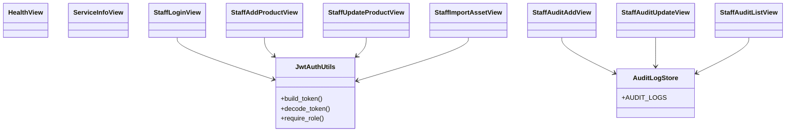

## 4) laptop-service

Chuc nang chinh:
- CRUD san pham laptop
- Search laptop
- Seed du lieu idempotent

## 5) mobile-service

Chuc nang chinh:
- CRUD san pham mobile
- Search mobile
- Seed du lieu idempotent

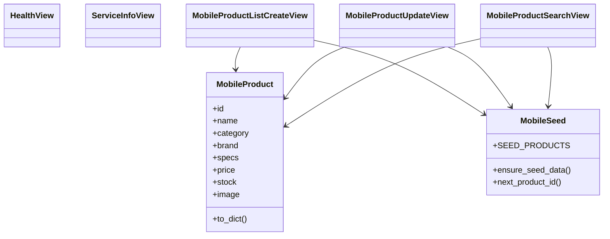

## 6) pc-service

Chuc nang chinh:
- CRUD san pham PC
- Search PC
- Inventory check/deduct an toan dong thoi
- Auto-sync status theo stock

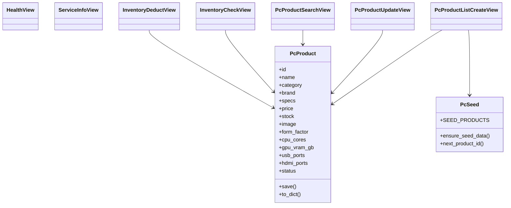

## 7) inventory-service

Chuc nang chinh:
- Quan ly ton kho tong quat
- Check stock va deduct stock
- API listing/detail ton kho

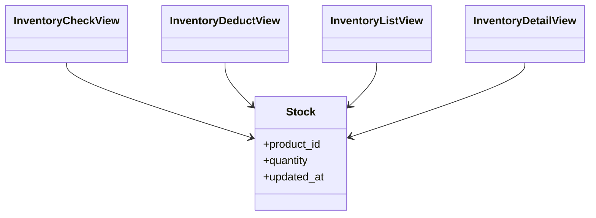

## 8) cart-service

Chuc nang chinh:
- Quan ly gio hang theo user/session
- Add/update/remove item
- Doc gio hang

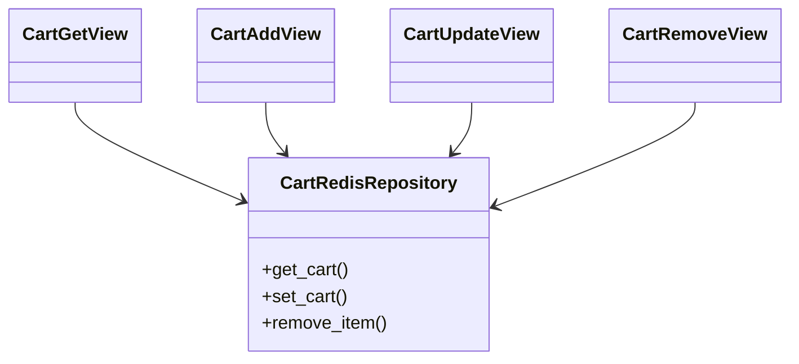

## 9) order-service

Chuc nang chinh:
- Tao don hang
- Checkout flow
- Luu order + order items

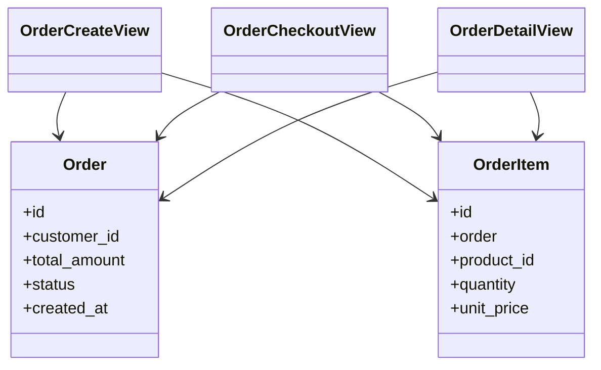

## 10) payment-service

Chuc nang chinh:
- Tao giao dich thanh toan
- Confirm thanh toan
- Listing lich su payment

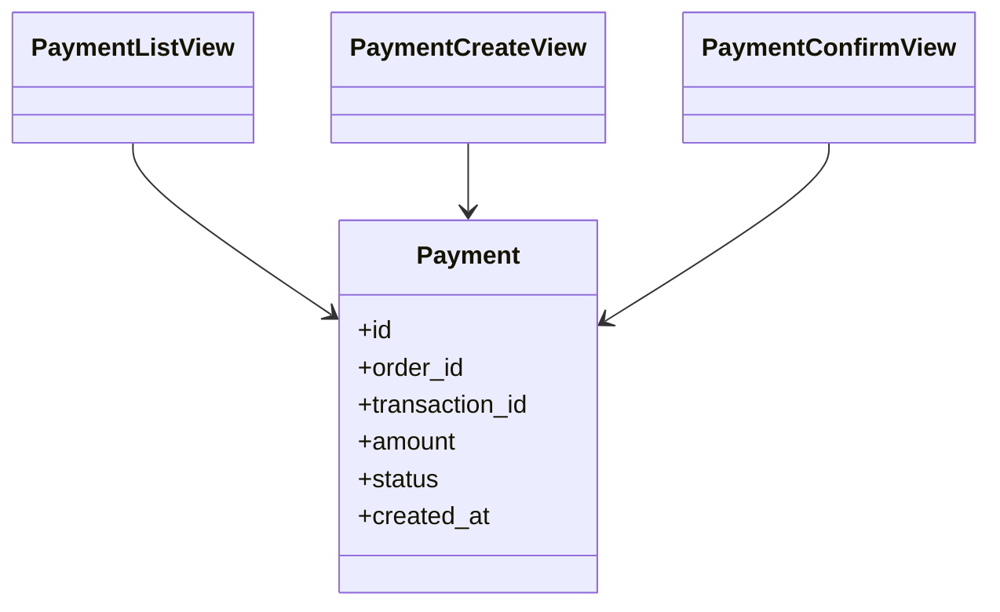

## 11) ai-service

Chuc nang chinh:
- Chat recommendation
- Parse intent
- Recommend san pham tu catalog live
- Hybrid RAG (KB + live catalog summary)
- Memory history theo user
- Staff API de xem KB va debug RAG

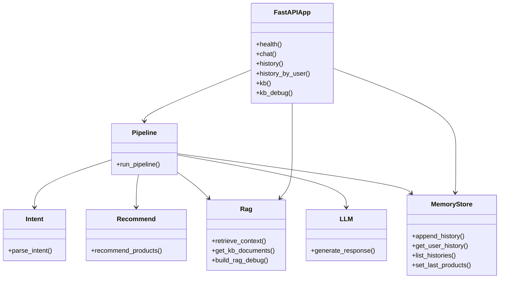

## 12) Service relation overview

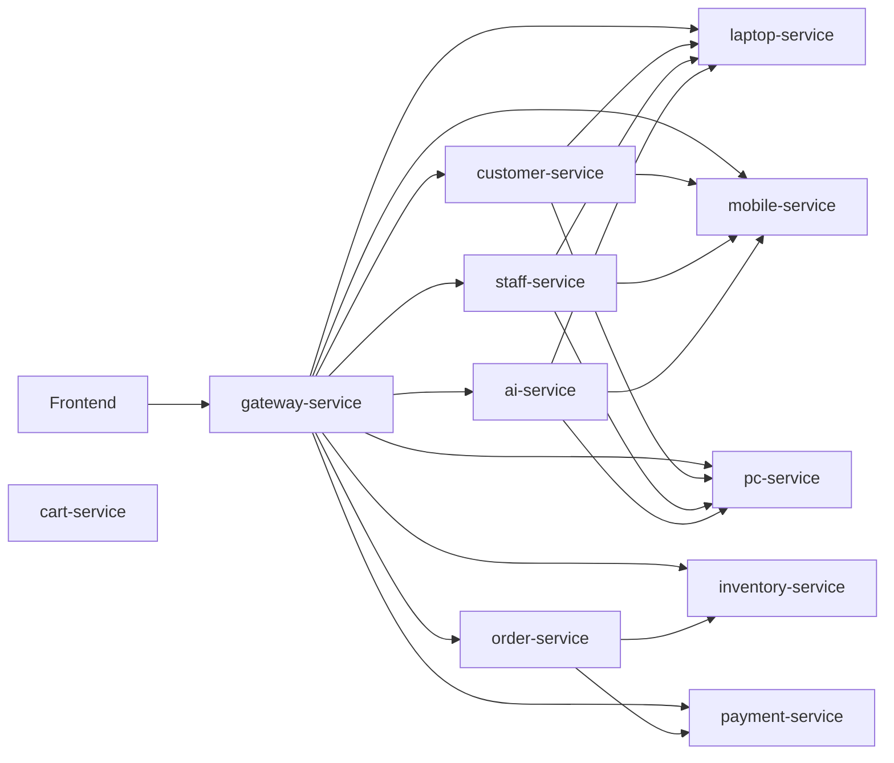
